------------------------------
# How Profitable are Good Movies?
-----------------------------

## Introduction:

In 1960, there were over 2,500 movies released in theaters1, mostly to screens in the United States. Reviews came mostly from local newspapers, and promotional budgets were almost negligible costs. By the turn of the century this number ballooned to close to 8000 movies a year 2 grossing more than 10.5 Billion US dollars, however, the cost of making movies skyrocketed as well.3. 

Gauging the quality of a movie is highly subjective, and with a plethora of online review sites available, reviews now can come from practically anyone and anywhere there is an internet enabled device. I intend to tap into some of this data and use statistical analysis to determine the likelihood of a "Good" movie being "Profitable".4

## The Data:

To do this, I have built a new database that combines information from IMDB, TMDB, Rotten Tomatoes, Movie Lens, Box Office Mojo  and the Academy Awards website. 

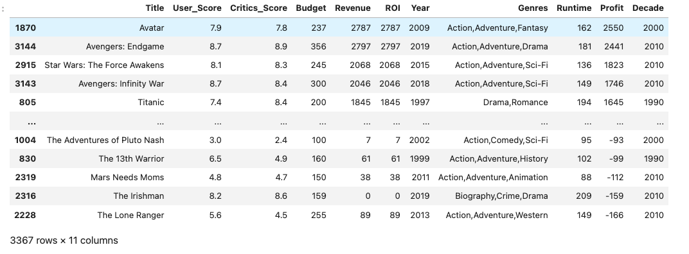

------------------------
## Defining Good
------------------------

Before I can begin any analysis of the data, I have to define some terms.
 
A 'good' movie should have:  
### An audience or user score/rating of 7.5 or higher. 

### A Critics score/rating of 7.5 or higher. 
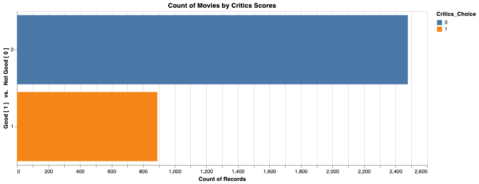

### An oscar win or nomination 
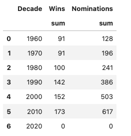

A 'Profitable' movie should have:  
### A positive net profit and an ROI of 300% or more

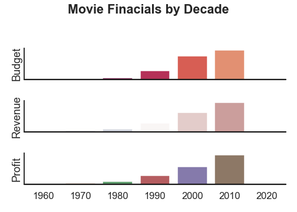

--------------------------

------------------------
## Analysis
------------------------
To make it facilitate the exploration of the data, I plotted the Revenue and Budget of each movie. 
This makes is easier to visualize which movies are "good" and which ones seem profitable based on the ROI.

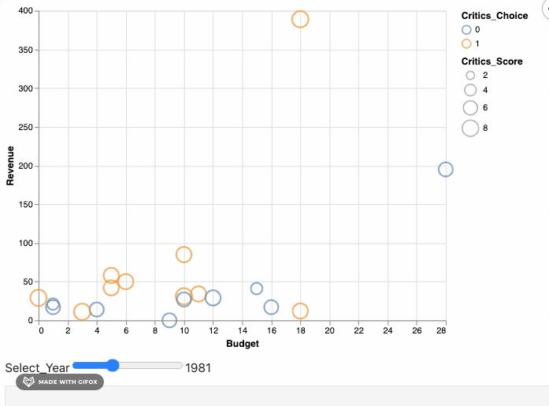  

I've color coded each movie depending on whether or not they are good based on critics choice (7.5 score or higher). A good movie will be colored orange and the rest are blue.
The size of each circle is determined by the actual critics score, which can range from 1 to 10.

I have also added a slider to help me traverse each year. 

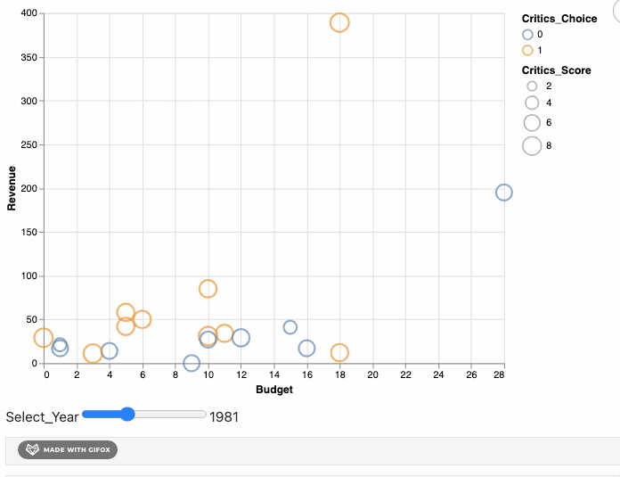 

I've created a variation of the chart, this time based on user score. I've also removed the slider to illustrate that we can see all the movies at once and where they stand as based on their features.

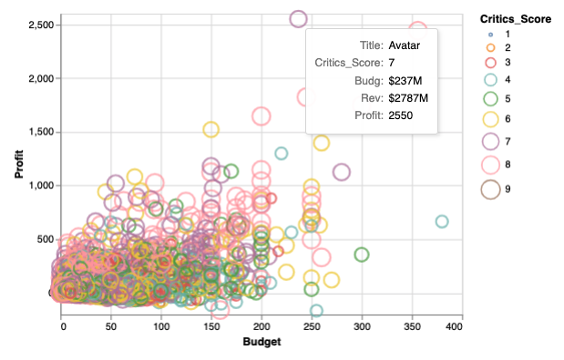 

------------------------
## Setting up Data for Bayesian Test
------------------------

Though the visualizations have given me insight and provided me with some intuition regarding my hypopthesis, I opted to run a Bayesian A|B test on the data. This will allow me to test whether or not being a 'good' movie will affect the probability of it being profitable.

To prepare the data for this test, I created flags within the data, telling me if, based on critics reviews, a movie is good or not good. A good movie is given a 1 and not good movie is given a 0. 
I've also done the same using user or audience reviews since although they seem similar, there are slight differences in what critics and users/audiences consider to be good. 
 
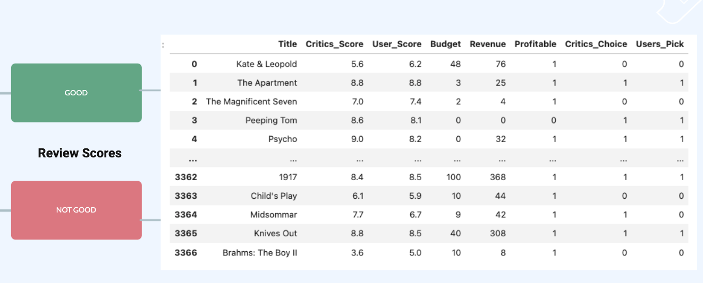 
I've done the same with the profitability of movies, wherein if the revenue is 3 times it's budget, I gave it a 1, if not then I gave it a zero.
 
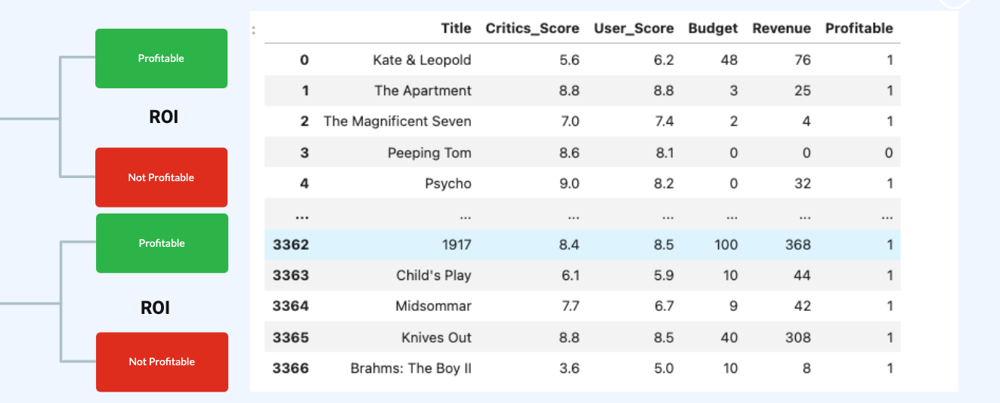 

------------------------

## Bayesian Test Results
------------------------

I ran the test using the data, and you will notice that there is clearly some difference in how 'good' movies and 'not good' movies are when it comes to profitability. There is some overlap where some not good movies make a lot of money, and vice versa where good movies bomb in the box office. 

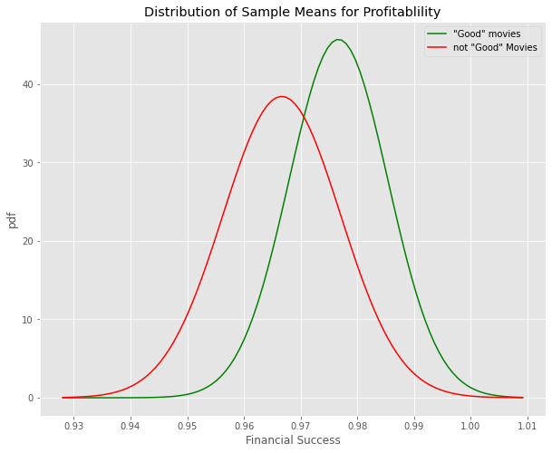 

After running the data more simulations, I have determined, that based on the critics scores, a "good" movie is 78.4% likely to have a high probability of it being financially successful. 
Using the users / audience scores, a "good" movie is 98.0% likely to have a high probability of it being financially successful.  

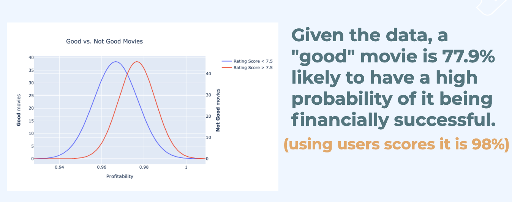 

------------------------
## More Observations
------------------------
 
Out of curiosity, I reversed the test, to ask "Are 'profitable' movies 'good'?"
and running the data, and a similar Bayesian test, the results were: 

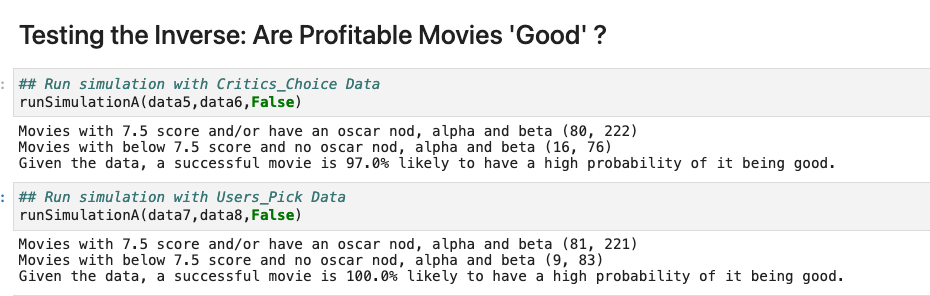 

------------------------
## Future Work
------------------------
  - inflation adjustment with financials
  - more data
  - sentiment analysis of review
  - a recomendatation system

citations: 
1 [imdb.com](https://www.imdb.com/search/title/?year=1960&title_type=feature&)  
2 [imdb.com](https://www.imdb.com/search/title/?year=2010&title_type=feature&)  
3 [natoonline.org](https://www.natoonline.org/data/boxoffice/ ) 
4 [Hyunjin-Jo on Quora](https://www.quora.com/How-much-should-a-big-budget-movie-make-at-the-box-office-relative-to-its-production-cost-to-be-considered-to-be-a-likely-financial-success/answer/Hyunjin-Jo)

