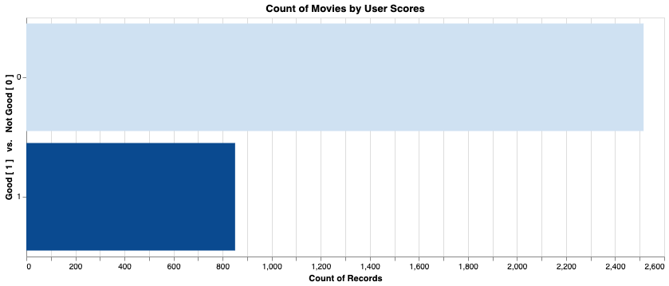

------------------------------
# How Profitable are Good Movies?
-----------------------------

## Introduction:

In 1960, there were over 2,500 movies released in theaters1, mostly to screens in the United States. Reviews came mostly from local newspapers, and promotional budgets were almost negligible costs. By the turn of the century this number ballooned to close to 8000 movies a year 2 grossing more than 10.5 Billion US dollars, however, the cost of making movies skyrocketed as well.3. 

Gauging the quality of a movie is highly subjective, and with a plethora of online review sites available, reviews now can come from practically anyone and anywhere there is an internet enabled device. I intend to tap into some of this data and use statistical analysis to determine the likelihood of a "Good" movie being "Profitable".4

## The Data:

To do this, I have built a new database that combines information from IMDB, TMDB, Rotten Tomatoes, Movie Lens, Box Office Mojo  and the Academy Awards website. 

------------------------
## Defining Good
------------------------

Before I can begin any analysis of the data, I have to define some terms.
 
A 'good' movie should have:  
### An audience or user score/rating of 7.5 or higher. 

### A Critics score/rating of 7.5 or higher. 

### An oscar win or nomination 

A 'Profitable' movie should have:  
### A positive net profit and an ROI of 300% or more

--------------------------

------------------------
## Analysis
------------------------

------------------------
## Setting up Data for Bayesian Test
------------------------

------------------------
## Bayesian Test Results
------------------------

------------------------
## More Observations
------------------------

------------------------
## Further Studies
------------------------

citations: 
1 [imdb.com](https://www.imdb.com/search/title/?year=1960&title_type=feature&)  
2 [imdb.com](https://www.imdb.com/search/title/?year=2010&title_type=feature&)  
3 [natoonline.org](https://www.natoonline.org/data/boxoffice/ ) 
4 [Hyunjin-Jo on Quora](https://www.quora.com/How-much-should-a-big-budget-movie-make-at-the-box-office-relative-to-its-production-cost-to-be-considered-to-be-a-likely-financial-success/answer/Hyunjin-Jo)

script outline:
 - intro
 - define good + plot
 - user scores + plot
 - critic scores + plot
 - oscars + plot (probability that you have an oscar if you have high score?)
 - define success + plot (budget vs revenue top 10?)
 - hypothesis test 1
 - revenue over decades
 - further studies
     - inflation adjustment in numbers
     - more data

